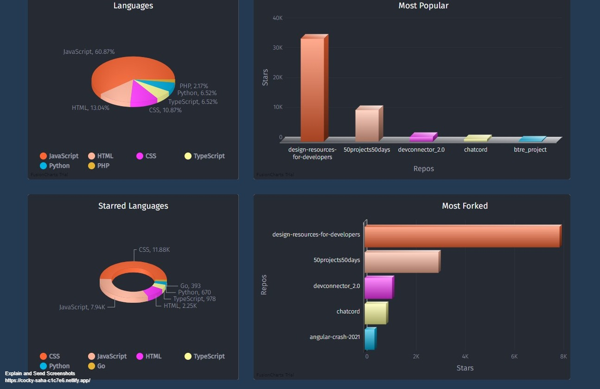
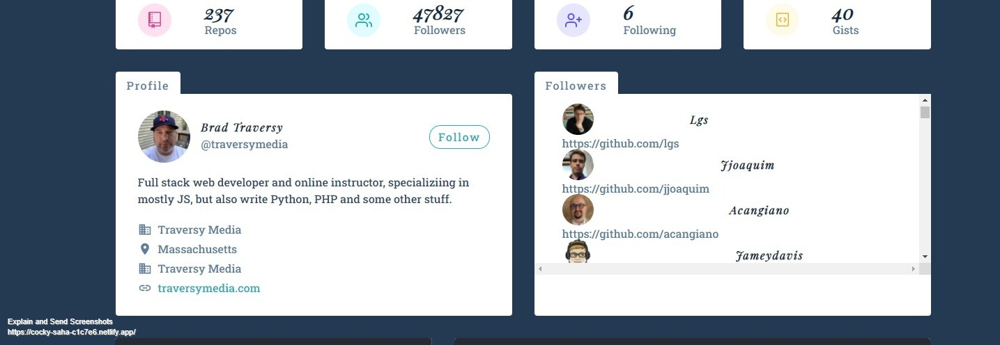
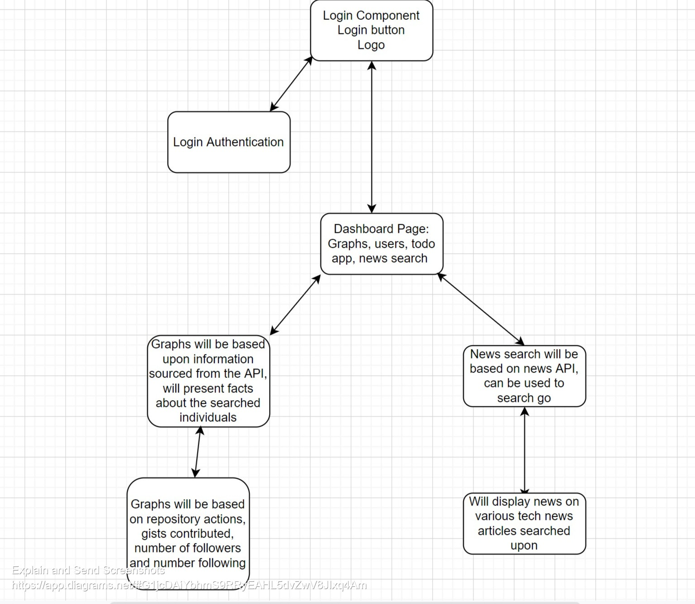

# Web Dev Starter Pack

React based project to help the inspiring juvenile programmer to find popular github users, their repos, gists and forked prjoects and choose between them wisely with animated statisics

## Features

- Login/logout with Auth0
- Dynamic user search
- Animated statistics
- Authentication with Auth0
- Tech based articles

## Demo

You can check the live demo at - [Web Deb Starter Pack]
(https://cocky-saha-c1c7e6.netlify.app/)

## Technologies used

- **Context API**
- **UseReducer**
- **Auth0** to use firestore and auth.
- **react-router-dom** for routing.
- **Styled components** for styling.
- **AXIOS** for http requests.
- **Fusion Charts** for data presention.

## Project Summary

This project marked the first time I had built a large scale React project.It involved studying and implementing Hooks, Function Components, UseContext, Auth0, UseReduce and Styled Components.
Quite the challenge it was and I for sure put blood, sweat and tears into it.
Hope you'll appreciate and enjoy it.
